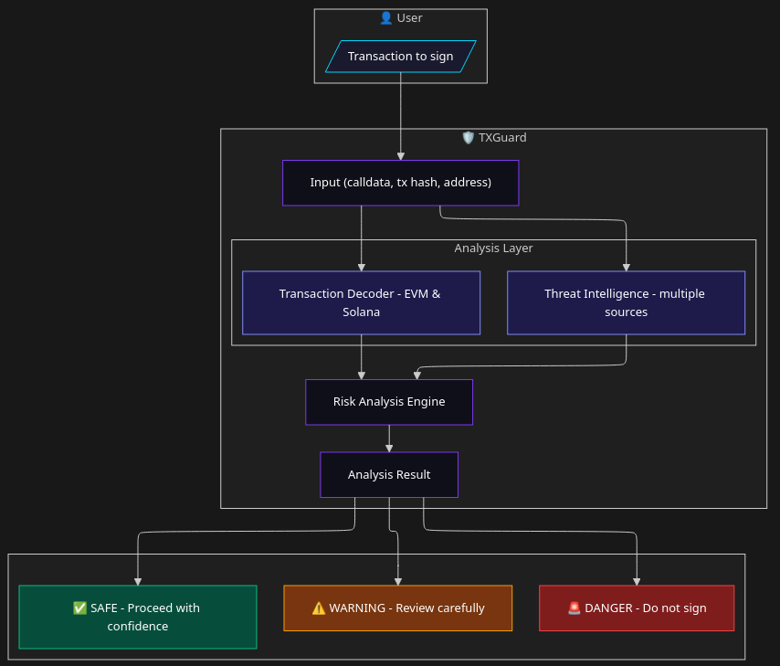

# TXGuard 🛡️

**Web3 Transaction Security Platform**

> *"It's the user's responsibility if they sign a malicious transaction"*  
> — Every bug bounty program response, ever.

**That’s exactly the problem TXGuard solves.**

---

## How it works

TXGuard analyzes blockchain transactions before they are signed by combining transaction decoding,
threat intelligence, and risk analysis.

TXGuard performs transaction analysis only and does not execute, broadcast, or sign transactions.

---

## The Problem

Users in Web3 are expected to:
- Read raw calldata like `0x095ea7b3000000...`
- Understand that `approve(MAX_UINT256)` means granting unlimited access
- Identify whether an address is a known drainer or phishing contract
- Verify complex contract interactions before signing

**Reality?**  
Most users simply click **“Confirm”** and hope for the best.

---

## The Solution

TXGuard analyzes blockchain transactions **before they are signed**, providing clear, human-readable security insights:

- 🔍 **Decoded calldata** — human-readable function calls and parameters
- ⚠️ **Risk assessment** — SAFE / LOW / MEDIUM / HIGH / CRITICAL
- 🚨 **Threat intelligence** — checks against known scammers, drainers, and malicious contracts
- 💡 **Actionable recommendations** — what to do before signing

TXGuard provides **analysis only**.  
It does **not** execute transactions, custody assets, manage wallets, or provide financial services.

---

## Origin Story

TXGuard was born out of frustration.

As a **penetration tester**, I discovered vulnerabilities in Web3 applications that allowed malicious contracts to be injected into legitimate user flows.  
When reported through bug bounty programs, the response was always the same:

> *"It's the user's responsibility to verify what they sign."*

But users don’t have the tools to verify.  
They see hex-encoded calldata and a **“Confirm”** button.

**TXGuard bridges that gap** — giving users and developers the same visibility that security researchers rely on.

---

## Features

- 🔓 **Transaction Decoding** — EVM & Solana support
- 🎯 **Risk Scoring** — multi-factor analysis (heuristics, patterns, reputation)
- 📊 **Threat Intelligence** — aggregated from multiple independent sources
- 🔔 **Real-time Alerts** — monitor wallet activity via public blockchain data
- 🔌 **API Access** — integrate TXGuard directly into your dApp or backend
- 🏢 **Team & Enterprise Features** — role-based access, audit logs, and reporting

---

## Tech Stack

| Layer | Technology |
|------|------------|
| Frontend | Next.js 14, React, TailwindCSS |
| Authentication | NextAuth.js, MFA (TOTP) |
| API | NestJS (decoding, analysis, threat intel) |
| Database | PostgreSQL, Prisma ORM |
| Cache | Redis |
| Payments | Paddle |
| Infrastructure | Docker, Nginx |

---

## Security

Built with a **security-first mindset**:

- ✅ Rate limiting (Redis + Nginx)
- ✅ Strict input validation (Zod schemas)
- ✅ SQL injection protection (Prisma ORM)
- ✅ XSS mitigation (React defaults + CSP headers)
- ✅ Multi-factor authentication (MFA)
- ✅ Audit logging and traceability
- ✅ Secure session management

---

## Status

🚀 Actively developed and continuously evolving.

TXGuard is an independent security-focused project built by a security researcher
to close a critical gap in Web3 transaction visibility.

---

## Documentation

- 📘 **Architecture & system overview** — [docs/architecture](docs/architecture/)
- 🔌 **API reference & examples** — [docs/api](docs/api/)
- 📜 **Policies (Terms & Privacy)** — [docs/policies](docs/policies/)

---

## Contact

- 🔐 Security issues: **security@txguard.io**
- 📩 General inquiries: **contact@txguard.io**

---

*Don’t trust. Verify. With TXGuard.*
